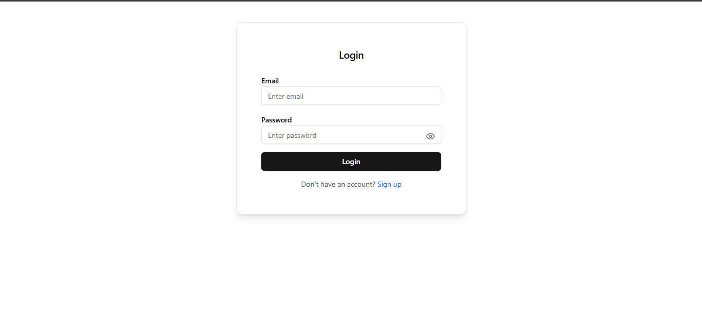
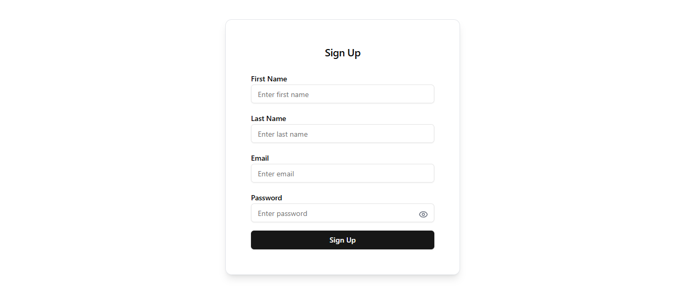
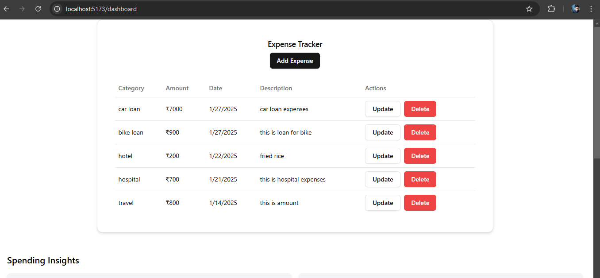
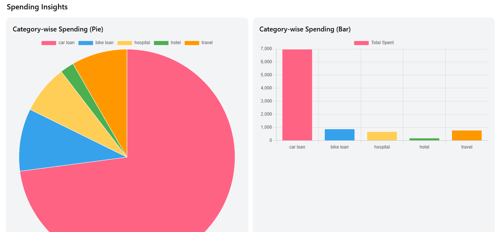

# Mini Expense Tracker

## 🚀 Overview

The **Mini Expense Tracker** is a full-stack web application that helps users track their expenses, categorize spending, and gain insights into their financial habits. The app features **JWT-based authentication**, **CRUD operations for expenses**, and **data visualization** through charts.

## 🌐 Live Demo

🔗 [Live Demo](https://expense-tracker-frontend-yrfq.onrender.com/) (if deployed)

## 🛠️ Tech Stack

- **Frontend:** React.js, MUI, MUI X Charts / Recharts, Tailwind CSS
- **Backend:** Node.js + Express.js (or Python + FastAPI)
- **Database:** MongoDB (Mongoose) or PostgreSQL (Sequelize)
- **Authentication:** JWT (HTTP-only cookies)
- **Deployment:** Render

## 🌟 Features

1️⃣ **User Authentication** (Register/Login using JWT)  
2️⃣ **Expense Management (CRUD)** (Add, Edit, Delete, View)  
3️⃣ **Filtering & Pagination** (Search by category & date range)  
4️⃣ **Spending Insights** (Pie chart & bar graph analytics)  
5️⃣ **Secure API** with authentication & validation

## 📸 Screenshots

| Login                               | Signup                                | Home                              |
| ----------------------------------- | ------------------------------------- | --------------------------------- |
|  |  |  |

| Dashboard                                   | Insights Chart                            |
| ------------------------------------------- | ----------------------------------------- |
|  |  |

## 📜 API Documentation

### **Authentication API**

#### **Register**

```http
POST /api/v1/users/register
```

#### **Login**

```http
POST /api/v1/users/login
```

#### **Logout**

```http
POST /api/v1/users/logout
```

#### **Add Expense**

```http
POST /api/v1/expense/add
```

#### **Update Expense**

```http
PUT /api/v1/expense/update/:id
```

#### **Delete Expense**

```http
DELETE /api/v1/expense/delete/:id
```

#### **Get Expense**

```http
GET /api/v1/expense/getinsights
```
